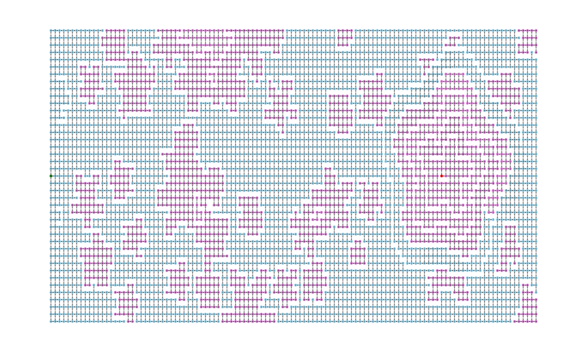
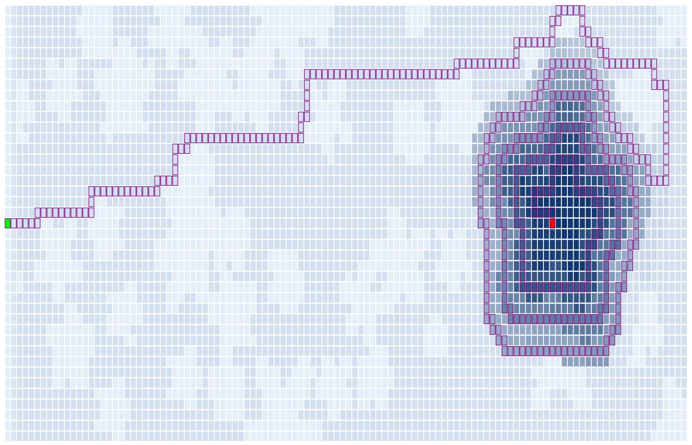

# Day 12

Figure out the disconnect between expected function and what's really happening
(in this case, I missed a detail in the rules). The code and sample images show
how to display the data with d3 and matplotlib and build graphs to:

Show reachability when the algorithm had an error:



Show the solution once you get it right:



## Quickstart

You can run `python day12-right.py` or `python day12-wrong.py` to generate JSON,
or you can uncomment the networkx/matplotlib code to produce some of the
intermediate graphs as PNGs if you're into that.

Scripts will require at least networkx and matplotlib; do
`pip install -r requirements.txt` (in a virtualenv or similar).

The `d3/` directory already contains the data required, just start up a
webserver to serve the content:

```bash
cd d3/
python3 -m http.server
```

Then just browse to the host/port being served (e.g. `http://0.0.0.0:8000/` in
the example above) in your favorite browser.

If you want to change between the two versions of the visualization (`right`
and `wrong`), just comment/uncomment the right `data_file` declaration in
`d3/day12.js`.
