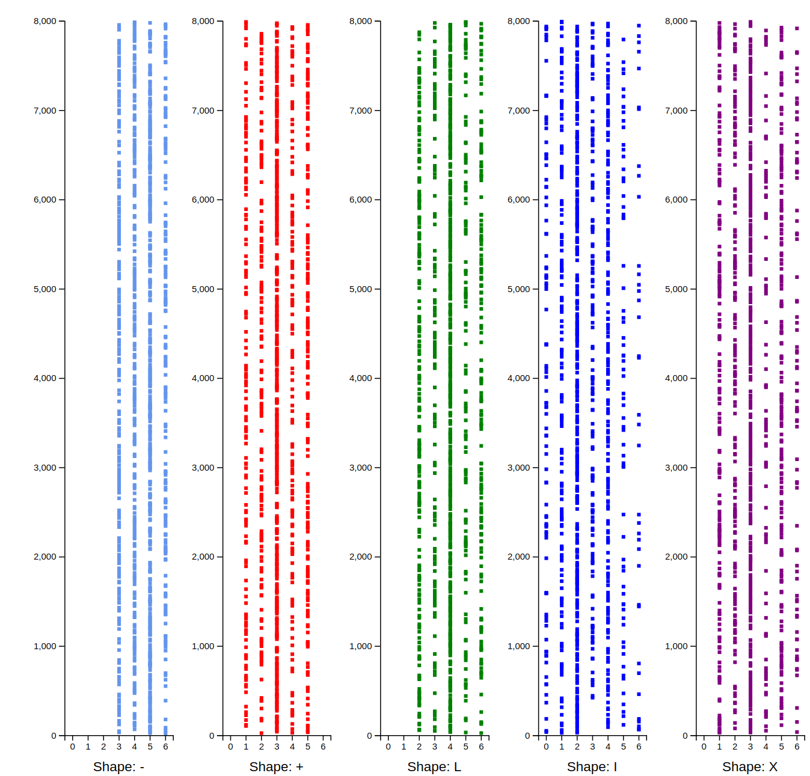

# Day 17

Find the cycle length by visual inspection of patterns (`block_type`, `x`, and
`height`).



## Quickstart

You can run `python day17.py` to generate the JSON yourself, but the real action
is in the `d3/` directory, and it has pre-populated data.

Change into the `d3/` directory and start up a webserver to serve the content:

```bash
cd d3/
python3 -m http.server
```

Then just browse to the host/port being served (e.g. `http://0.0.0.0:8000/` in
the example above) in your favorite browser.
